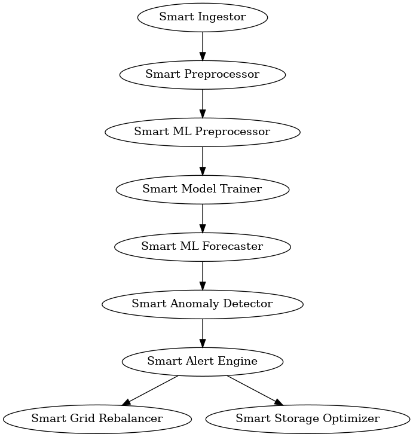

# ⚡ AI-Pipeline for Real-Time Smart Grid Energy Management

This project implements an **AI-powered, self-adaptive pipeline** for smart grid energy forecasting, preprocessing, training, and alerting using **Apache Kafka**, **Flask microservices**, and **ML intelligence** to auto-select the pipeline flow based on live context and learned patterns.

---

## 📌 Project Goals

- Fully automated ML pipeline for grid data analysis
- Real-time energy forecasting and anomaly detection
- Kafka-based decoupled communication across services
- Self-learning AI orchestrator deciding optimal pipeline flow
- Plug-n-play architecture: `docker-compose up` and go!

---

## 🧠 AI-Driven Pipeline Logic

Instead of traditional orchestration via fixed logic, this system uses a smart decision engine that learns patterns from past runs, system states, and runtime metrics to:

- Decide **which services to run and in what order**
- Bypass unnecessary nodes when confidence is high
- Trigger model retraining dynamically
- Adjust paths based on seasonal/time-of-day/weekly patterns

---

## ⚙️ System Architecture



### 🔧 Nodes (Microservices)

| Node | Description |
|------|-------------|
| `smart-ingestor` | Downloads raw energy data and streams to Kafka |
| `smart-preprocessor` | Cleans and validates raw data |
| `smart-ml-preprocessor` | Feature engineering and scaling |
| `smart-model-trainer` | Trains model if needed |
| `smart-ml-forecaster` | Generates live energy forecasts |
| `smart-anomaly-detector` | Detects grid anomalies from forecasts |
| `smart-alert-engine` | Sends alerts on anomalies or outages |
| `smart-grid-rebalancer` | Suggests redistribution actions |
| `smart-storage-optimizer` | Optimizes battery/storage use |
| `ai-pipeline-manager` | ML-based orchestrator for smart routing |

---

# 🚀 Quick Start Guide: Running the AI-Pipeline

This guide provides concise steps to launch the full AI-powered Kafka-based pipeline.

---

## 🛠 Prerequisites

- Docker and Docker Compose installed
- Python 3.9+ with `venv` (for optional local interaction)
- SSH setup with GitHub (already configured)
- Internet connection to pull Python dependencies

---

## 🧠 Pipeline Overview

The pipeline consists of modular AI microservices:
- `smart-ingestor`: Ingests real-time data
- `smart-preprocessor`: Prepares and cleans data
- `smart-ml-preprocessor`: ML-specific preprocessing
- `smart-model-trainer`: Trains models when needed
- `smart-ml-forecaster`: Predicts future energy trends
- `smart-anomaly-detector`: Flags anomalies in energy patterns
- `smart-alert-engine`: Generates real-time alerts
- `smart-storage-optimizer`: Optimizes energy storage decisions
- `smart-grid-rebalancer`: AI-driven grid balancing logic
- Kafka + Zookeeper for inter-service streaming

---
## 🔁 How to Run the Pipeline

```bash
# Step 1: Navigate to the folder
cd AI-Pipeline

# Step 2: Start the pipeline
docker-compose up --build
```

> 📝 NOTE: The first run may take some time as it pulls all dependencies.

---

## 🔍 Verifying It Works

To test Kafka is receiving data from the ingestor:

```bash
docker exec -it kafka-1   kafka-console-consumer --bootstrap-server localhost:9092   --topic raw_energy_data --from-beginning --max-messages 5
```

To inspect logs of any service:

```bash
docker logs -f kafka-live-orchestrator-smart-ingestor-1
```

---

🧠 How the AI-Pipeline Works
	•	The AI Scheduler Node uses intelligent orchestration to:
	•	Detect new or updated data streams
	•	Dynamically decide which smart node to trigger next
	•	Skip or retrain modules based on performance or context
	•	Eliminate rigid pipelines or manual orchestration

This AI-first approach ensures adaptive, data-driven flow control in real-time.

---

## 📂 Folder Structure

```
AI-Pipeline-Kafka/
├── ai-pipeline-manager/
├── smart-alert-engine/
├── smart-anomaly-detector/
├── smart-grid-rebalancer/
├── smart-ingestor/
├── smart-ml-forecaster/
├── smart-ml-preprocessor/
├── smart-model-trainer/
├── smart-preprocessor/
├── smart-storage-optimizer/
├── kafka/
│   ├── kafka.Dockerfile
│   └── zookeeper.Dockerfile
├── docker-compose.yaml
├── AI_Pipeline_Architecture.png
└── README.md
```

---

## 🌐 Powered By

- Python, Flask
- Apache Kafka & Zookeeper
- Scikit-learn, pandas, httpx
- Docker, Compose
- Real-time Smart Grid APIs (e.g., EirGrid)

---

## 👨‍🔬 Designed With

- 💡 Modularity
- 🧠 ML-first orchestration
- 🔁 Self-healing & continuous learning
- ⚙️ Minimal setup for non-technical users

---

## 📣 Contributors

- **VaibhavTechie** (Creator, Vision)
- **Abhishek Tomar** (Creator, Designing, and testing)


---

**📦 Just plug & play. The AI handles the rest.**
