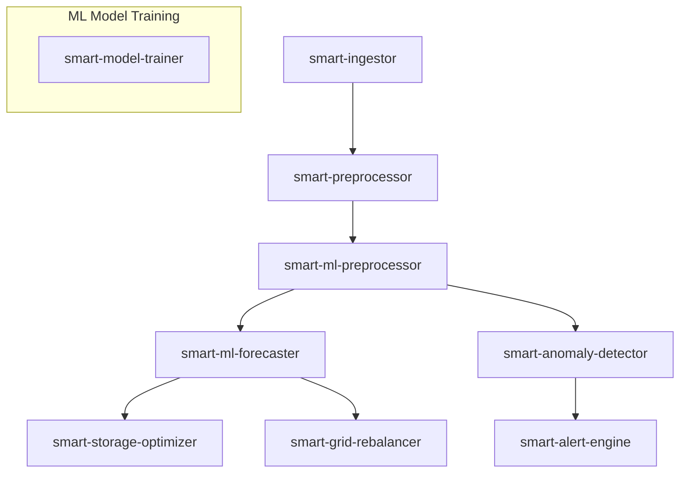

# How to Run the Kafka Energy Pipeline


## Prerequisites

- Docker & Docker Compose installed
- Internet connection to pull base images (on first run)
- `docker-compose.yml` file correctly set up with all services
- Environment variables like `KAFKA_SERVER` and `KAFKA_TOPIC` defined in Compose or Dockerfiles

---

## Starting the Pipeline

1. **Navigate to the root directory** containing your `docker-compose.yml` file.

2. **Build and launch all services:**

```bash
docker compose up -d --build
```

This starts Kafka, Zookeeper, and all the `smart-*` services.

---

## Triggering Live Data Ingestion

Once all containers are running, you can **start live ingestion** with:

```bash
curl http://localhost:<INGESTOR_PORT>/stream
```

Replace `<INGESTOR_PORT>` with the actual port (like `5100`) mapped to the `smart-ingestor`.

---

## Checking Logs for Any Node

To see logs for a specific service:

```bash
docker ps
docker logs <container_name>
```

Example:
```bash
docker logs ai_kafka_final-smart-ingestor-1
```

---

## Stopping the Pipeline

To stop and clean up:

```bash
docker compose down
```

To remove volumes as well (be cautious with this):
```bash
docker compose down -v
```

---

# Kafka Energy Pipeline — Full Microservices Breakdown

This document provides a complete technical breakdown of each microservice included in our `AI_Kafka_Final` project. It explains the purpose, internal logic, and how they integrate within the real-time AI energy forecasting and optimization pipeline.

---

## Overview of Microservices

- **smart-ingestor**: Fetches live grid data from external APIs and publishes it to Kafka.
- **smart-preprocessor**: Cleans and standardizes incoming data.
- **smart-ml-preprocessor**: Extracts machine learning features from preprocessed data.
- **smart-ml-forecaster**: Makes energy demand/supply predictions.
- **smart-anomaly-detector**: Detects anomalies using predictive analytics.
- **smart-storage-optimizer**: Suggests optimal battery storage/discharge.
- **smart-alert-engine**: Sends alerts based on predictions or anomalies.
- **smart-model-trainer**: Trains models using historical data.
- **smart-grid-rebalancer**: Executes energy rebalance decisions.

---

## 1. smart-ingestor

**Purpose**: Collects real-time data from Smart Grid Dashboard APIs and streams it to Kafka.

**Key Files**:
- `ingestor.py`: Main live data ingestion loop.
- `app.py`: Flask API to trigger ingestion (`/stream`).
- `get_live_data`: Continuously yields data categories (demand, wind, CO2, etc.).

**Concepts**: `asyncio`, `httpx`, `KafkaProducer`, `Flask`, background threading.

---

## 2. smart-preprocessor

**Purpose**: Cleans raw grid data for downstream machine learning.

**Key Files**:
- `preprocessor.py`: Applies filtering, type conversion, timestamp formatting.
- `app.py`: REST API to expose preprocessing as a service.

**Concepts**: `pandas`, `KafkaConsumer`, `KafkaProducer`, data pipelines.

---

## 3. smart-ml-preprocessor

**Purpose**: Converts the preprocessed time series into ML-feature vectors.

**Key Files**:
- `feature_builder.py`: Extracts rolling statistics, time deltas, etc.
- `app.py`: Flask service to serve feature transformation.

**Concepts**: `scikit-learn`, feature engineering, temporal data encoding.

---

## 4. smart-ml-forecaster

**Purpose**: Makes short-term predictions on energy demand and supply.

**Key Files**:
- `forecaster.py`: Loads trained model, predicts using latest features.
- `app.py`: Flask interface for forecasting service.

**Concepts**: ML inference, `joblib`, `pandas`, Kafka integration.

---

## 5. smart-anomaly-detector

**Purpose**: Detects unexpected spikes/drops using statistical methods (Still a WIP).

**Key Files**:
- `detector.py`: Uses thresholds or unsupervised models (like Isolation Forest).
- `app.py`: Detects anomalies and pushes alerts or flags to Kafka.

**Concepts**: Outlier detection, time series analysis, unsupervised ML.

---

## 6. smart-storage-optimizer (WIP)

**Purpose**: Decides how energy storage (batteries) should be used based on forecast (Work in Progress).

**Key Files**:
- `optimizer_logic.py`: Optimization heuristics or rule-based decisions.
- `optimizer_loop.py`: Listens to forecasts, applies storage strategy.

**Concepts**: Optimization algorithms, energy management rules.

---

## 7. smart-alert-engine (WIP)

**Purpose**: Sends alerts when thresholds or anomaly rules are met.

**Key Files**:
- `alert_loop.py`: Monitors data and triggers actions.
- `alerter.py`: Defines alert rules and logic.

**Concepts**: Real-time monitoring, alert scheduling, Kafka-based event triggers.

---

## 8. smart-model-trainer (A bit Wonky at the moment)

**Purpose**: Trains and saves ML models for forecasting, anomaly detection, etc.

**Key Files**:
- `model_trainer.py`: Loads historical data, trains models.
- `feature_engineer.py`: Extracts trainable features.
- `consumer.py`: Optional Kafka-based training trigger.

**Concepts**: Model training, `scikit-learn`, persistence using `joblib`.

---

## 9. smart-grid-rebalancer (WIP)

**Purpose**: Final decision maker — acts on forecasts to adjust energy usage.

**Key Files**:
- `rebalance_loop.py`: Consumes data and executes rebalance logic.
- `rebalancer.py`: Contains core rebalance strategy.

**Concepts**: Rule-based logic, policy evaluation, downstream control signals.

---

## Integration Flow Summary



---

## Deployment Notes

- All services are in Docker containers.
- Kafka topics are the ones which behave as a subsitute for the orchestrator, each node has a predefined topic and communicate async with other nodes.
- Each service exposes its functionality via Flask or Kafka listeners.

---

## Final Thoughts

This architecture promotes modular, scalable, and maintainable infrastructure for real-time energy grid optimization making use of Kafka.
Strong base to implement the protobuf protocol to make the nodes be able to interact with eachother independent of the source code like python,java etc.
